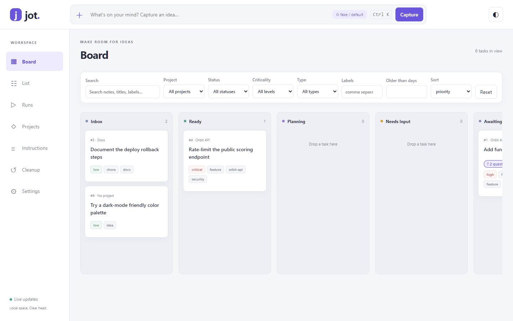
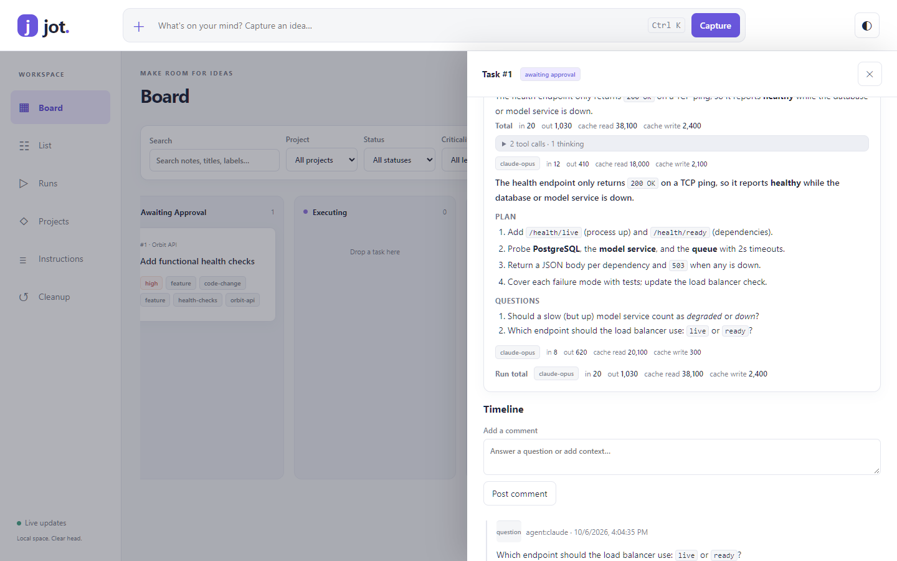

# jot

[](https://github.com/mikejhill/jot/actions/workflows/ci.yml)

[](LICENSE)

Jot is a lightweight task tracker with agent drawdown. Type a quick note, and an LLM turns it into a structured task. When you want the work done, Claude, Codex, or Copilot draws it down: it plans, asks questions, waits for your approval, and executes in an isolated git worktree. Everything runs locally on SQLite, with a CLI, a web UI, and agent skills, and needs no hosted service.



```text
jot add "orbit api - health check is simple ping; need to make holistic"
  -> project: Orbit API · labels: orbit-api, health-checks, feature, code-change
     criticality: medium · title: "Make Orbit API health check holistic instead of a simple ping"
     description: problem, desired outcome, acceptance criteria
```

## Highlights

- **Fast capture:** use the capture bar (`Ctrl+K`), `jot add`, or ask an agent. Enrichment fills in the title, description, project, labels, criticality, and type.
- **Agent drawdown:** choose the planned flow (plan, then approve, then execute) or the direct flow, using Claude, Codex, or Copilot, with any model for each action.
- **Readable runs:** agent output renders as Markdown, every turn shows its model and token usage, and tool and thinking steps collapse.
- **One-click queue:** List view rows have Plan, Run now, Approve, and Send back buttons, and expand to show the plan inline.
- **Conflict-free:** atomic, lease-based claims mean multiple agents never work the same task.
- **Yours to tune:** markdown instruction files control triage, drawdown, and cleanup, globally or per project.



## Quick start

Requires Python 3.13+ and [uv](https://docs.astral.sh/uv/). Each agent backend is optional; install whichever ones you use: Claude Code (`claude auth login`), Codex CLI, or GitHub Copilot CLI. Jot uses their existing logins and needs no API keys.

```bash
uv tool install git+https://github.com/mikejhill/jot   # puts `jot` on PATH
jot install-skills --target claude --target codex --target copilot
jot serve --open                                        # http://127.0.0.1:8765
```

Data lives in `~/.jot` by default (`JOT_HOME` overrides it). From a clone, use `uv tool install --editable .` so code changes apply without reinstalling. If an update adds a dependency, stop `jot serve` and run `uv tool install --force --editable .` once to pick it up.

## Documentation

| Guide | What's inside |
| --- | --- |
| [User guide](docs/user-guide.md) | Capture, drawdown flows, questions, models, the List view, finding and cleaning up tasks, the data home |
| [Architecture](docs/architecture.md) | Data model, claims and leases, agent backends (and swapping SDKs), usage tracking, code layout |
| [Development](docs/development.md) | Setup, unit, UI, and browser tests, screenshots, CI |
| [Contributing](CONTRIBUTING.md) | Workflow and checks for changes |

## License

[MIT](LICENSE)
