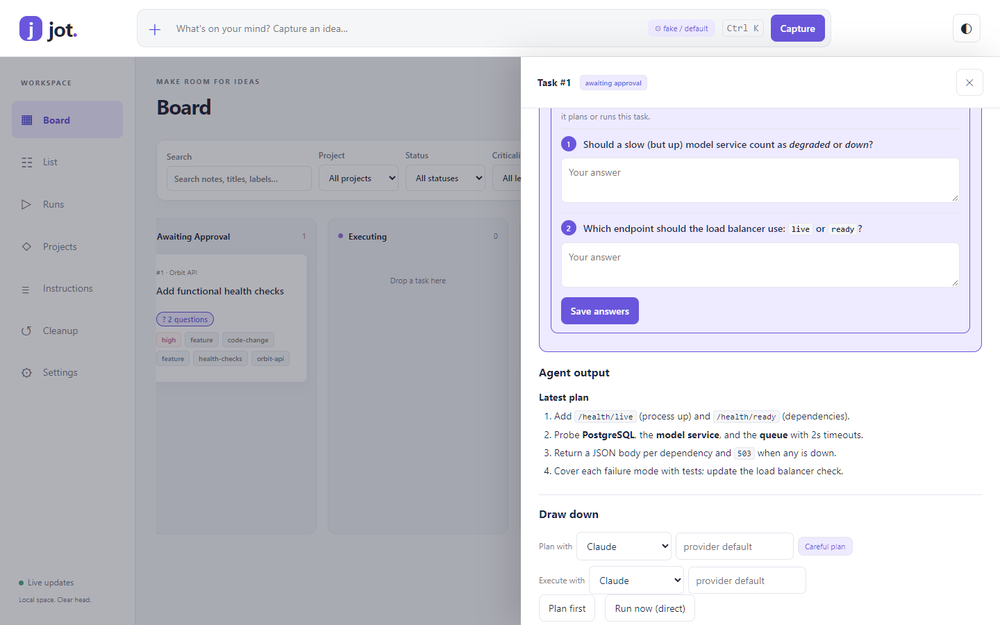
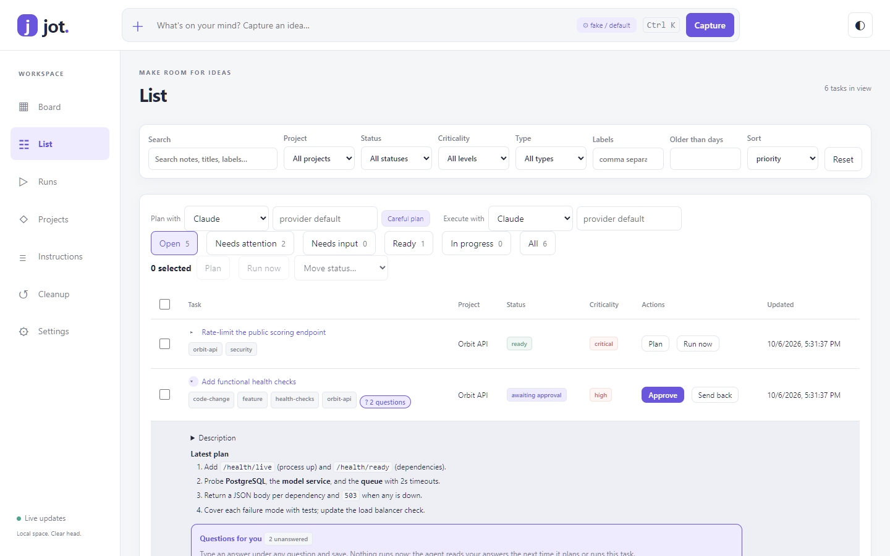
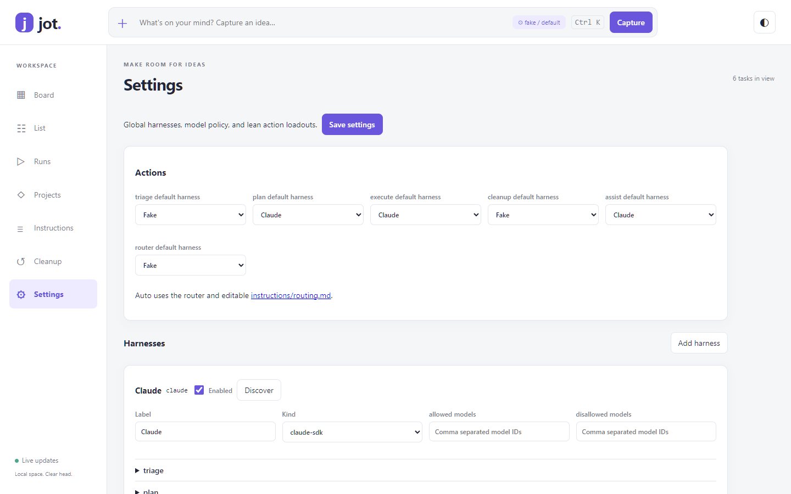
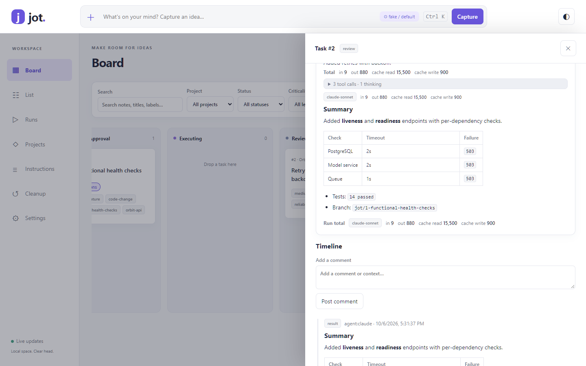
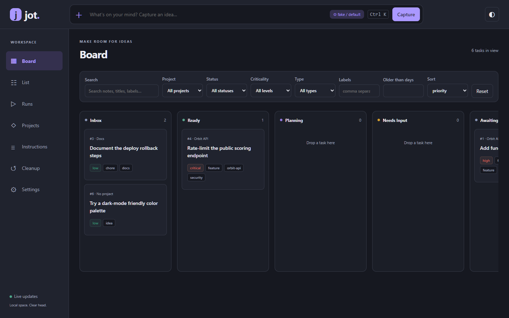

# User guide

- [Data home](#data-home)
- [Capture](#capture)
- [Draw down](#draw-down)
- [The List view](#the-list-view)
- [Agent settings](#agent-settings)
- [Reading runs](#reading-runs)
- [Find and clean up](#find-and-clean-up)

## Data home

Data lives in `JOT_HOME` (default `~/.jot`, i.e. `%USERPROFILE%\.jot` on Windows). Point separate installs or contexts at different homes to keep their data apart.

| Path | Purpose |
| --- | --- |
| `jot.db` | SQLite database (WAL). Query it with any SQLite tool, or use `jot export --format jsonl\|md` |
| `config.toml` | Backends and models, default flow, concurrency, isolation and worktree location, port, cleanup thresholds |
| `instructions/triage.md` | How notes become tasks: label vocabulary, criticality rubric |
| `instructions/drawdown.md` | How agents prioritize, refine, ask questions, plan, and execute (including whether to push and open PRs) |
| `instructions/routing.md` | Guidance for Auto harness/model selection |
| `instructions/cleanup.md` | What counts as stale or duplicate |
| `instructions/projects/<slug>.md` | Per-project guidance (repo conventions, test commands) |
| `runs/<id>.jsonl` | Full agent logs: text, thinking, tool calls, per-turn usage |
| `worktrees/<repo>/<id>-<slug>` | Git worktrees for execute runs |
| `backups/` | `jot backup` snapshots |

Every instruction file can also be edited in the UI (Instructions view).

## Capture

- **UI:** use the capture bar at the top of every view (`Ctrl+K`, then Enter). The task appears instantly and fills in when enrichment finishes.
- **CLI:** `jot add "<note>"` returns in about 100 ms. Enrichment runs in the server's background worker, or immediately with `--wait`. Pre-fill fields with `--project --label --crit --type --title --repo`.
- **Agents:** the `jot` skill (installed by `jot install-skills`) teaches Claude Code, Codex, and Copilot every Jot workflow: capture, query and groom, drawdown, and cleanup. Its `SKILL.md` routes to one reference file per workflow.

Enrichment reuses existing projects (matched by slug, name, or alias) and existing labels, so labels don't drift into synonyms. A task with clear scope moves to `ready`. An unclear one stays in `inbox`, and its open questions are recorded on the task. Set `[triage] backend` in `config.toml` to `claude`, `codex`, or `copilot`.

## Draw down

There are two flows. Choose one per run, or set a default per task, per project (`--default-flow`), or globally.

```text
planned: inbox → ready → planning → awaiting_approval → executing → review → done
direct:  inbox → ready → executing → review → done
either:  planning | executing → needs_input → (answers) → same phase again
```

Only runs move a task into `planning` or `executing`. Dragging a card there doesn't start anything, so the board doesn't offer it.

```bash
jot next -n 5                      # ranked queue: criticality × project priority × age
jot plan 12 --backend claude       # read-only plan -> awaiting_approval (needs_input if it has questions)
jot answer 12 -a 41="Postgres"     # answer question event 41 and resume the run
jot approve 12 --note "answers…"   # execute -> review
jot run 12 --direct --backend codex
jot run --next --project orbit-api
jot send-back 12 "use the existing retry helper"   # -> ready, feedback kept for next run
jot runs 12; jot log <run-id>
```

**Answering questions.** Agents and triage can ask you questions. They show up in three places:

- **Task panel:** a highlighted **Questions for you** box at the top, with one answer field per question (radio buttons when the agent suggested choices).
- **List:** a **? N questions** badge on the row. Click it to expand the row and answer inline.
- **Board:** the same badge on the card.



What the button does depends on the task's status:

- **Waiting on you** (`needs_input`, a run paused to ask): **Send answers and continue** saves your answers and resumes that run (plan or execute). Blank answers leave the decision to the agent.
- **Any other status:** **Save answers** records them without starting anything. The agent reads them in the task history the next time it plans or runs.

The **Needs attention** preset in the List includes every task with unanswered questions. From the CLI: `jot show <id> --json` lists the question event IDs, and `jot answer <id> -a <question-id>="text"` saves answers (and resumes the run if the task is waiting on input).

**Choosing models.** Every action can use a different model. Set defaults per backend and action in `config.toml`:

```toml
[models.claude]
triage = "haiku"
plan = "opus"
execute = "sonnet"
cleanup = "default"   # "default" = the provider's default
```

Override any single run with `--model` on `jot plan`, `run`, `approve`, `enrich`, and `cleanup scan`, or with the "Plan with" and "Execute with" pickers in the UI. Each run records the model it used.

**Where agents work.** The task's `repo_path`, else the project's `repo_path`, else a scratch folder that is its own git repository. Execution in a git repo happens in a worktree at `~/.jot/worktrees/<repo>/<id>-<slug>` on branch `jot/<id>-<slug>`. Change the location with `[execution] worktree_root`. The agent commits there and stays inside the working directory. It pushes or opens a PR only if your drawdown instructions say to.

**Permissions.** Plan runs are read-only (Claude: read tools only; Codex: `--sandbox read-only`; Copilot: view/grep/glob only). Execute runs have full tool access inside the workspace.

**External agents.** The `jot` skill's drawdown workflow lets an interactive Claude, Codex, or Copilot session use the same protocol: `jot claim`, then `jot comment --kind plan|question|result`, then `jot release --status …`.

## The List view



Every row has one-click actions for its status: **Plan** and **Run now** (ready), **Answer** or **Approve** and **Send back** (waiting on you), **Done** and **Send back** (review), **Cancel** (running), and **Mark ready** (inbox). The "Plan with" and "Execute with" pickers above the table choose the backend and model for those buttons. Expand a row (▸) to read the latest plan, answer questions, or approve inline. Presets: Open, Needs attention, Needs input, Ready, In progress, All. Select rows to plan, run, or move several at once.

## Agent settings

Open **Settings** (`#/settings`) to edit harnesses, action defaults, pins, instructions, and loadouts. **Save settings** validates the whole configuration before replacing `config.toml`; existing table comments survive edits. New settings apply to subsequent actions without restarting the server. In-flight runs retain their selected backend and loadout.



- **Harnesses:** create several named instances of `claude-sdk`, `codex-cli`, `copilot-cli`, or `fake`. Give each a label, enable it, and choose per-action defaults. `fake` runs offline for tests and demos.
- **Model policy:** an empty allowed list permits all models except those denied. Disallowed always wins. Set permitted defaults before assigning a restricted harness to an action. Explicit picks outside policy fail with a clear error.
- **Action defaults:** select a harness for triage, plan, execute, cleanup, assist, and router. Answers resume the plan or execute phase. An explicit harness/model wins over action defaults; `default` selects the provider's default model.
- **Pins:** global named harness/model shortcuts. Add, reorder, or remove them, and optionally limit each to selected actions. Click a pin to fill a picker. There are no project overrides for harnesses or loadouts.
- **Pickers:** the capture bar's `⚙ triage` chip opens the same picker used in the drawer and List toolbar. Capture remains one text field plus Enter. The chosen triage harness/model is saved with the capture and used by enrichment. Picks are remembered per action in browser storage when available.
- **Auto:** choose Auto in the harness select or enter `auto` as the model. A lean LLM router receives a task summary, the action, enabled harness/model candidates, and applicable pins. Edit `instructions/routing.md` in Instructions to guide it. Invalid output or a failed routing call falls back to the action default. The timeline records the choice, reason, and reported router usage; routing logs live in `runs/routing-<task-id>.jsonl`.
- **Loadouts:** plan, execute, and assist default to lean, with repo project instructions on. Triage, cleanup, and router are always fully lean. Discover runs a short provider session to populate capability checkboxes; Codex currently returns an empty best-effort inventory. Claude supports skills, strict MCP subsets, and local plugin paths. Explicit MCP subsets use definitions under the harness's `config.mcp_servers`. Codex exposes feature disables and repo-document control; Copilot uses its MCP, custom-instruction, and plugin-directory flags. Provider capabilities differ.

```toml
[harnesses.fast]
kind = "codex-cli"
label = "Fast chores"
models.allowed = ["gpt-6-luna", "default"]
models.default = { triage = "gpt-6-luna", cleanup = "gpt-6-luna" }
instructions.plan = "Prefer small, reviewable steps."
config.disable_features = ["browser_use", "image_generation"]

[actions]
triage = "fast"
router = "fast"

[[pins]]
label = "Quick capture"
harness = "fast"
model = "gpt-6-luna"
actions = ["triage"]
```

Existing `[triage] backend/model`, `[drawdown] backend`, and `[models.claude|codex|copilot]` remain supported through implicit harnesses named `claude`, `codex`, and `copilot`.

```bash
jot harness ls
jot harness show fast
jot harness discover fast
jot pins ls
jot plan 12 --harness fast --model gpt-6-luna
jot plan 12 --harness auto
jot enrich 12 --model auto
```

`--backend` remains an alias for `--harness` on every existing agent command.

## Reading runs



Open a task to see its runs and timeline:

- **Markdown:** agent messages, results, plans, questions, and comments render as Markdown. Plan runs reply with structured JSON (summary, plan, questions), shown as sections. The renderer builds DOM nodes directly and never injects HTML, so raw HTML in agent output appears as text. Links are limited to `http(s)` and `mailto`.
- **Collapsed steps:** consecutive tool calls and thinking steps fold into one block ("3 tool calls · 1 thinking"). Click to expand.
- **Usage:** after every turn, a line shows the model plus input, output, cache-read, and cache-write tokens, and each run shows its total. Claude's per-turn figures come from the API's final `message_delta` usage. Codex reports per turn (input net of cached input). The Copilot CLI reports only the model and premium requests, not tokens.
- **Harness and loadout:** each new run stores its harness ID and selected capability summary. Older runs may have neither. Auto explanations also appear in run output.
- **Timeline:** system events read as sentences ("ready → planning (claim)", "Label added: idea").

**Links and theme.** Every view and task has a shareable link: `#/list`, `#/board`, `#/runs`, and `#/board/task/12` (opens that task's panel). The browser back and forward buttons work. List is the default view. The theme button in the top bar cycles through System (follows your OS), Light, and Dark, and remembers your choice:



## Find and clean up

```bash
jot ls --project orbit-api --status ready --label security --crit high
jot ls --older-than 60d --status inbox
jot ls --q "health check"          # full-text search (FTS5) over title, description, note, labels
jot cleanup scan --agent           # heuristics + LLM review using cleanup.md
jot cleanup apply 3 --approve 0,2  # only approved items; archive / soft-delete / note
```

The `jot` skill runs the same review conversationally. It also queries the queue and suggests changes to apply with your approval: reprioritize, refine, merge or split tasks, fill in missing fields, or pick the next tasks to run. Nothing changes without item-level approval.
